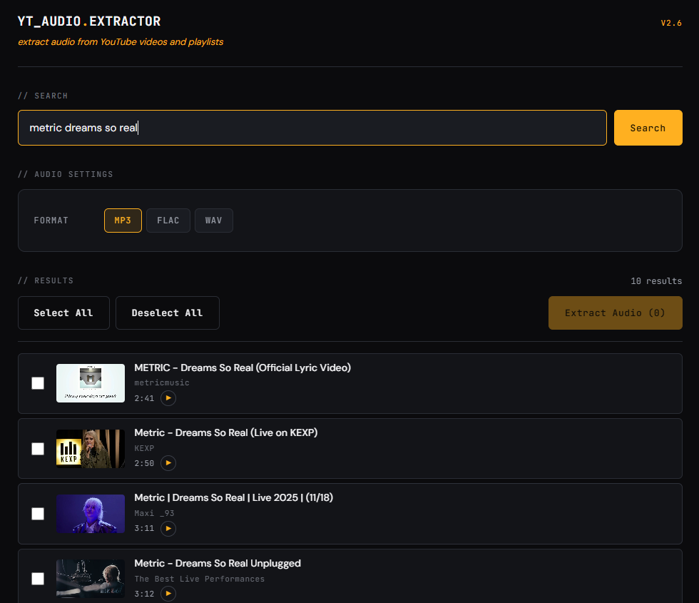
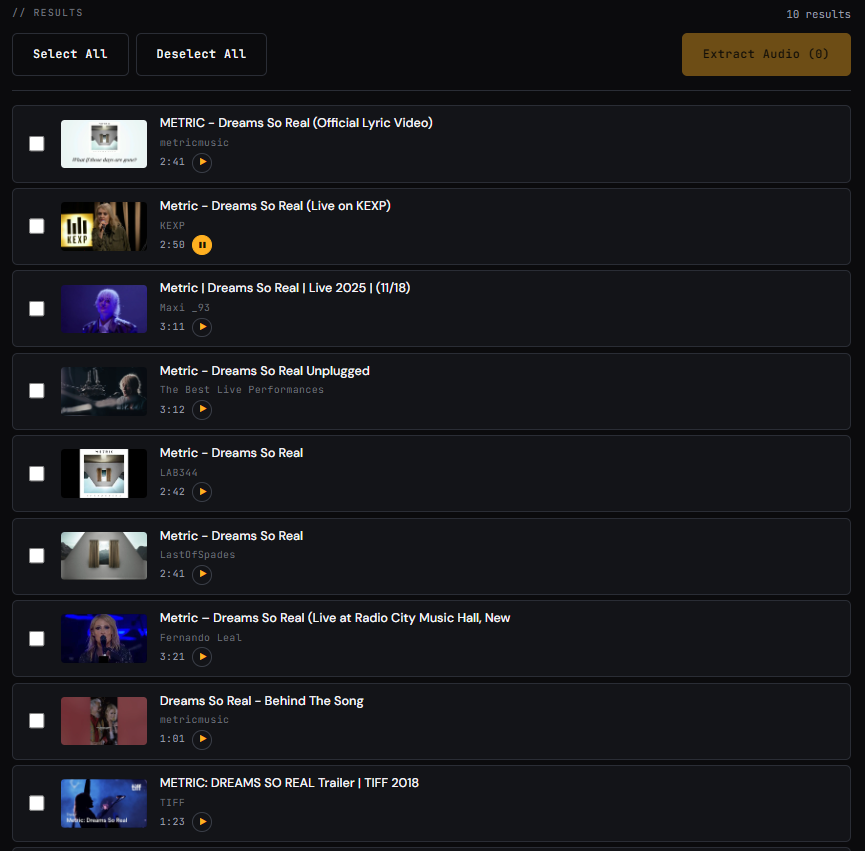
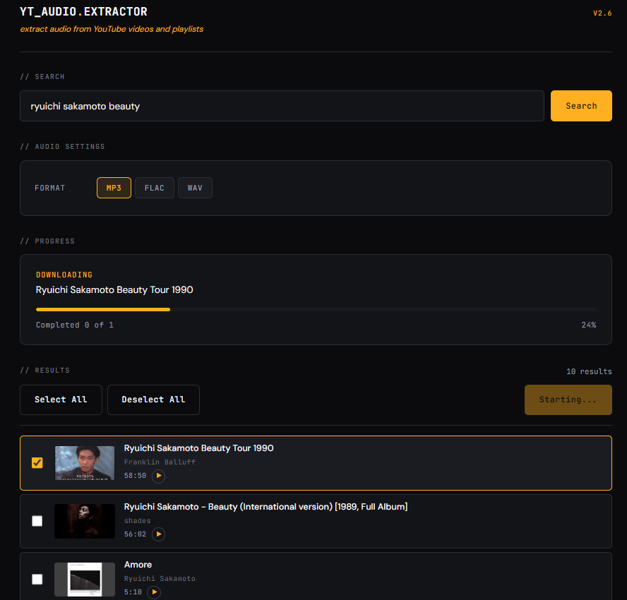
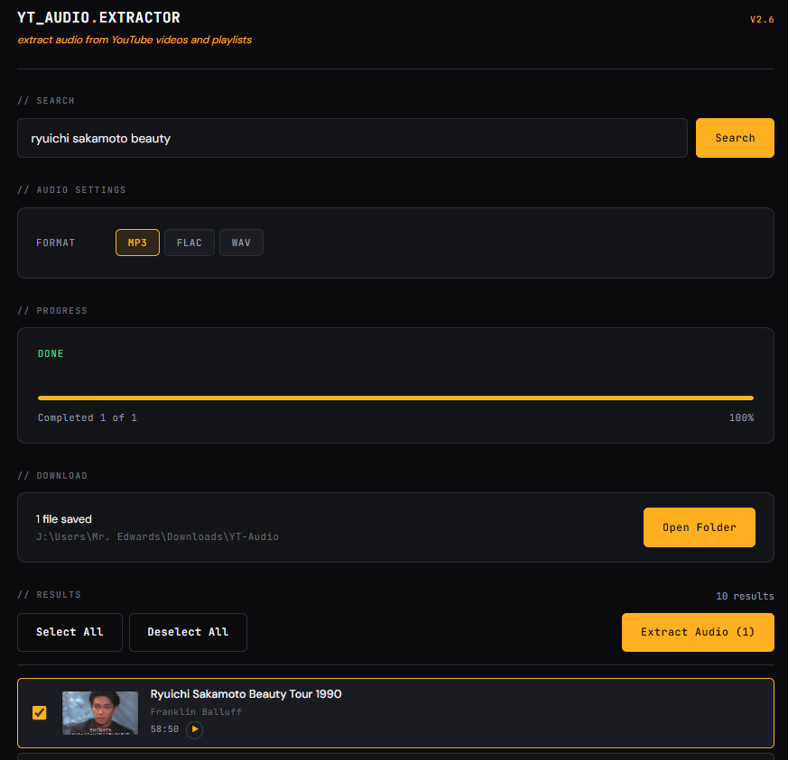
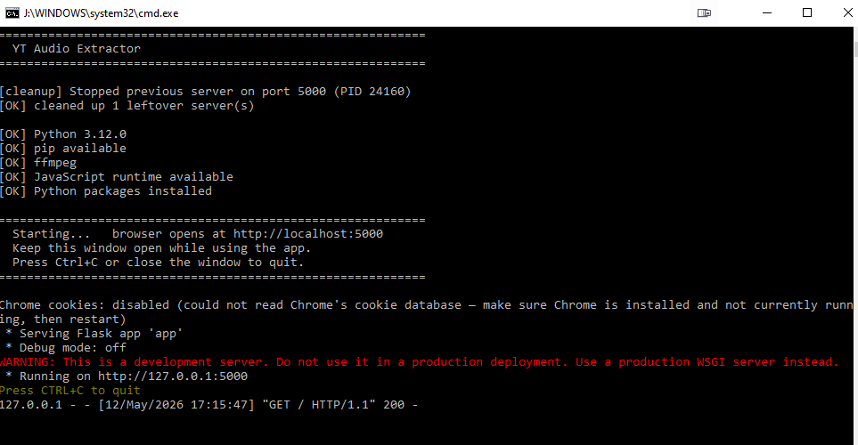

<div align="center">



# YT Audio Extractor

**A polished local web app for extracting audio from YouTube videos and playlists.**


</div>

Search YouTube, preview audio in-browser before committing, extract one track or a whole playlist to MP3 / FLAC / WAV. Runs entirely on your machine — nothing leaves localhost except requests to YouTube itself. No cloud, no account, no telemetry.

---

<div align="center">

### Powered by [yt-dlp](https://github.com/yt-dlp/yt-dlp)

This app is a GUI front-end built on top of **[yt-dlp](https://github.com/yt-dlp/yt-dlp)** — the open-source powerhouse that handles all YouTube interaction, format selection, and audio extraction under the hood. yt-dlp is maintained by a dedicated team of contributors and is the backbone that makes this app possible. If you find it useful, consider [starring their repository](https://github.com/yt-dlp/yt-dlp) and reading [their docs](https://github.com/yt-dlp/yt-dlp#readme).

</div>

---

## Quick Setup (Windows)

> **No technical experience needed.** Follow these four steps and you'll be running the app in under 10 minutes.

---

### Step 1 — Install Python

Python is the language this app is built in. You need version **3.10 or newer**.

**[⬇ Download Python from python.org](https://www.python.org/downloads/)**

> ⚠️ **Important:** During installation, check the box that says **"Add Python to PATH"** before clicking Install. If you miss this, the app won't start.

<details>
<summary>How do I know if Python is already installed?</summary>

Open a Command Prompt (press `Win + R`, type `cmd`, press Enter) and run:
```
python --version
```
If you see `Python 3.10.x` or higher, you're good. If you see an error, install it using the link above.
</details>

---

### Step 2 — Install ffmpeg

ffmpeg is what converts the downloaded audio into MP3, FLAC, or WAV. It runs in the background — you never interact with it directly.

**[⬇ Download ffmpeg from ffmpeg.org](https://ffmpeg.org/download.html)**

For Windows, the easiest path:
1. Download the **"Windows builds from gyan.dev"** release (the `essentials` build is fine)
2. Extract the zip — you'll get a folder like `ffmpeg-7.x-essentials_build`
3. Move that folder somewhere permanent (e.g. `C:\ffmpeg`)
4. Add `C:\ffmpeg\bin` to your system PATH

<details>
<summary>How do I add a folder to PATH?</summary>

1. Press `Win + S` and search for **"Edit the system environment variables"**
2. Click **Environment Variables…**
3. Under **System variables**, find **Path** and click **Edit**
4. Click **New** and paste the path to ffmpeg's `bin` folder (e.g. `C:\ffmpeg\bin`)
5. Click OK on all windows, then **restart any open terminals**

To verify it worked, open a new Command Prompt and run `ffmpeg -version`. You should see version info.
</details>

---

### Step 3 — Install a JavaScript runtime

yt-dlp (the download engine) needs a JavaScript runtime to work with current YouTube. **Deno** is the recommended option — it's a single install and stays out of your way.

**[⬇ Install Deno](https://deno.com/)** — or run this in a Command Prompt:
```
winget install DenoLand.Deno
```

<details>
<summary>What if I already have Node.js?</summary>

Node.js works too. If `node --version` returns something in a Command Prompt, you're all set — skip this step.
</details>

---

### Step 4 — Download and launch the app

1. **[⬇ Download this project](../../archive/refs/heads/master.zip)** and unzip it to a folder of your choice (e.g. `C:\Apps\YT-Audio-Extractor`)
2. Open that folder and **double-click `YT-Audio-Extractor.bat`**

The launcher will:
- Check that Python, ffmpeg, and the JS runtime are found
- Automatically install the remaining Python packages on first run (just press Enter when prompted)
- Open the app at **http://localhost:5000** in your browser

> 💡 For a permanent desktop shortcut with the app's icon, right-click `YT-Audio-Extractor.bat` → **Create shortcut**, then right-click the shortcut → **Properties → Change Icon** and point it at `YT-Audio-Extractor.ico` in the same folder.

---

### Troubleshooting first-launch issues

| What the launcher says | What to do |
|---|---|
| `[X] Python is not installed or not on PATH` | Reinstall Python and make sure **"Add to PATH"** is checked |
| `[X] ffmpeg is not installed or not on PATH` | Check that you added ffmpeg's `bin` folder to PATH and opened a **new** terminal |
| `[!] No JavaScript runtime found` | Install Deno: `winget install DenoLand.Deno` in a Command Prompt |
| App opens but downloads fail with errors | Quit Chrome completely (including background processes) and relaunch the app |

---

## Features

- 🔎 **Unified search bar** — paste a URL (single video or playlist) or type a search query
- ▶ **In-browser audio preview** — small play button on each result streams the audio directly via a yt-dlp-resolved stream URL, so you can decide *before* downloading
- 📦 **Batch extraction** — select multiple tracks, watch each one's progress in real time via Server-Sent Events
- 🎵 **MP3, FLAC, WAV** — best-quality VBR for MP3; lossless for FLAC and WAV
- 📁 **Direct-to-disk output** — files land in `~/Downloads/YT-Audio` and persist; no zip-and-download round trip through the browser
- 🍪 **Chrome cookies passthrough** — when Chrome is closed, the app probes whether it can read your local Chrome cookies and passes them to yt-dlp, so YouTube treats requests as authenticated
- ⏱ **Anti-bot pacing** — randomized 3-7 s pause between consecutive tracks, plus a 1 s interval between yt-dlp's internal requests during search
- 🚀 **One-click Windows launcher** — auto-cleans stale processes, verifies environment (Python, ffmpeg, JS runtime), installs Python deps on first run, opens the browser
- 🪟 **Open Folder that actually focuses** — uses a Win32 Alt-tap trick to bypass Windows' focus-stealing prevention, so the new Explorer window jumps in front of the browser

---

## Screenshots

### Search results with audio preview


Each row has a small ▶ button next to the duration. Click it to preview the audio without leaving the page — the button pulses while the stream URL resolves (~1-2 s on first click, cached after that), then fills amber while playing.

### Real-time extraction progress


Server-Sent Events push state changes from the Python worker thread to the browser: per-track download progress, conversion status, completion count, and any errors. No polling.

### Done — open the folder


Files persist in `~/Downloads/YT-Audio`. The Open Folder button uses an OS-level shim that raises File Explorer above the browser window.

### Launcher: environment checks + auto-cleanup


The Windows launcher kills any leftover Flask server on port 5000, then verifies every dependency before starting. Missing pieces get actionable error messages, not Python tracebacks.

---

## Tech stack

| Layer | Technology |
|---|---|
| Backend | Python 3.10+, Flask |
| Engine | yt-dlp (Python API), ffmpeg |
| Frontend | Vanilla HTML + CSS + JS (no framework, no build step, single file) |
| Realtime | Server-Sent Events for job progress |
| Launcher | Windows `.bat` with environment probes, auto-cleanup, and a one-time desktop-shortcut installer |
| Icon | Generated programmatically from a Pillow script (kept in repo) |

---

## macOS / Linux

```bash
git clone https://github.com/Edulus/YT-Audio-Extractor.git
cd YT-Audio-Extractor
pip install -r requirements.txt
python app.py
```

The app opens at `http://localhost:5000` in your default browser. Install ffmpeg via `brew install ffmpeg` or `apt install ffmpeg`.

---

## Usage

1. **Search** — type a query or paste a YouTube URL.
2. **Preview** — click the small ▶ next to any result to audition the audio.
3. **Pick** — tick the videos you want. **Select All** grabs the whole list.
4. **Choose format** — MP3, FLAC, or WAV. Quality is always set to best.
5. **Extract** — click **Extract Audio (N)**. The Progress panel shows the active track, a progress bar, and a per-track count. Between tracks the app pauses 3-7 s.
6. **Open Folder** — when the job finishes, click **Open Folder** to jump to `~/Downloads/YT-Audio` in File Explorer.

---

## Design decisions

A few choices worth explaining — the things that aren't obvious from reading the code.

### Why Server-Sent Events for progress?

The progress stream is one-way (server → browser) and the natural unit is a small JSON payload pushed whenever state changes. Polling at 500 ms intervals would have worked but wastes HTTP round-trips and adds latency for state changes. WebSockets would have been overkill — they're two-way and require dependency upgrades. SSE is built into the browser (`EventSource`), trivially proxied through Flask's `Response(generator, mimetype='text/event-stream')`, and matches the data flow exactly.

### Why direct-to-disk instead of zip-and-download?

The earlier design wrote files to a per-job temp dir, then served them as a zip through the browser when the user clicked Download. That's the standard web-app pattern, but it's a redundant round-trip for a *local* app — the files were already on the user's disk; making them stream through Flask just to land in `~/Downloads` is silly. The current version writes straight to `~/Downloads/YT-Audio` and offers an **Open Folder** button that opens File Explorer at that path. No zip, no Content-Disposition dance, no temp cleanup.

### Why Chrome cookies passthrough, and how does it fall back?

yt-dlp accepts a `cookiesfrombrowser=('chrome',)` option that reads your Chrome cookie DB and includes the session cookies on requests. This makes YouTube treat the app as a logged-in user, which dramatically reduces rate-limiting and bot-flagging. The catch: when Chrome is running on Windows, it locks the cookie database and the read fails with a `DownloadError`. Naive code would crash every request. The app probes once at startup by calling `yt_dlp.cookies.extract_cookies_from_browser('chrome', ...)` with a silent logger; on failure, a module-level `CHROME_COOKIES_AVAILABLE = False` flag flips and all downstream `_maybe_with_cookies()` calls quietly skip the option. The startup log says `Chrome cookies: enabled` or `Chrome cookies: disabled`. No request ever sees the cookie error.

### Why an Alt-tap before opening Explorer?

`os.startfile()` correctly spawns an Explorer window pointed at the output folder, but on Windows the new window often opens behind the browser. The culprit is [foreground-window lock](https://learn.microsoft.com/en-us/windows/win32/api/winuser/nf-winuser-setforegroundwindow): a non-foreground process (Python) is not allowed to raise a window over the active app (the browser). The standard workaround is to simulate an Alt key down+up via `keybd_event`, which Windows treats as user-initiated input and which clears the foreground lock for the calling process. With the lock cleared, `SwitchToThisWindow` + `SetForegroundWindow` succeeds. The whole sequence runs in a daemon thread that polls `EnumWindows` for up to 2 s waiting for the Explorer window to appear.

### Why a custom launcher instead of a README "Quick Start"?

A README that says "open a terminal and run `python app.py`" filters out everyone who doesn't already use a terminal. `YT-Audio-Extractor.bat` is a 130-line script that:
- Kills any stale Flask listener on port 5000 (auto-recovery from previous runs)
- Probes for Python ≥ 3.10, pip, ffmpeg, and a JS runtime, with actionable install hints for any missing piece
- Installs Python deps (`pip install -r requirements.txt`) on first run with a Y/N prompt
- Launches the app and the browser
- Pauses on non-zero exit so error messages stay visible

### Why generate the icon programmatically?

The icon is a 6-resolution `.ico` (16/32/48/64/128/256) rendered fresh at each size to avoid downsampling artifacts at small dimensions. `generate_icon.py` uses Pillow to draw the amber play triangle inside an amber ring on a dark circle — matching the app's color palette. Keeping the generator in the repo means the icon can be regenerated or tweaked without manual image editing.

---

## Project layout

```
.
├── app.py                       # Flask backend: search, preview, extract, status (SSE), open-folder
├── templates/
│   └── index.html               # Single-page frontend (HTML + inline CSS + inline JS)
├── static/
│   ├── favicon.svg              # Browser tab icon
│   └── favicon.ico              # Browser tab icon fallback (for Chrome)
├── requirements.txt             # Python deps (flask, yt-dlp)
├── YT-Audio-Extractor.bat       # Windows launcher (cleanup → env checks → run)
├── YT-Audio-Extractor.ico       # Desktop shortcut icon (6 resolutions)
├── generate_icon.py             # Pillow-based regenerator for the icon
└── docs/
    └── screenshots/             # README screenshots
```

---

## License

MIT
